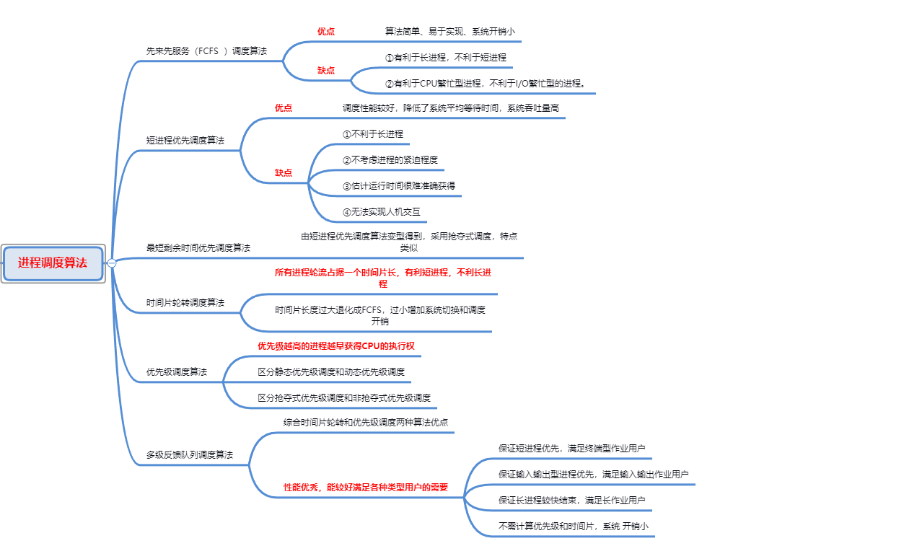

# 第一章

1. 操作系统的概念：操作系统是计算机系统中的一个系统软件，它统一管理计算机的软硬件资源，控制程序的执行，提供人机交互的接口和界面。
2. 操作系统的发展：
   - 手工操作阶段
   - 批处理操作系统
   - 多道批处理系统 ：是一种软件技术，可同时允许将若干相互独立的程序装入系统内存，并交互进入CPU运行
   - 分时、实时和通用操作系统(分时类似于时间片轮转)
     - 多道分时系统的特征：
       - 同时性
       - 独立性
       - 及时性
       - 交互性
   - 现代操作系统
3. 现代操作系统：
   - 微机操作系统
   - 网络操作系统
   - 分布式操作系统
   - 嵌入式操作系统
   - 未来操作系统
4. 操作系统的五大功能：
   - 处理器管理的功能
   - 存储管理的功能
   - 设备管理的功能
   - 文件管理的功能
   - 作业管理的功能
5. 操作系统的四大特征:
   - 并发
   - 共享
     - 互斥共享方式(互斥信号量)
     - 同步共享方式(同步信号量)
   - 虚拟
   - 异步性
6. 操作系统的三大作用：
   - 作为用户与计算机硬件系统之间的接口
   - 作为计算机系统资源的管理者
   - 用作扩充机器

# 第二章	进程管理

1. 进程的定义：可并发执行的程序在一个**数据集**上的一次执行过程，它是系统资源进行分配的**基本单位**。

2. 进程的五个基本特征：

   - 动态性
   - 并发性
   - 独立性
   - 异步性
   - 结构特征：进程 = 程序段 + 数据段 + 进程控制段

3. 进程的基本状态和转换

   - 就绪状态

   - 运行状态

   - 等待状态

     

     1. 就绪 ------> 运行状态
     2.  运行 -----> 等待
     3.  运行 -----> 就绪
     4.  等待 -----> 就绪

4. 线程：比进程**更小**的能够独立运行的**基本单位**——**线程**

   线程定义：

   - 线程是进程中的一个实体，是可以独立参与调度的基本单位。
   - 一个进程可以有一个线程或多个线程，它们共享所属进程所拥有的资源。
   - 生命周期内存在运行、就绪和等待态

5. 进程控制：

   - 定义：通过使用具有特定功能的程序段来创建、撤销进程以及完成进程状态之间的转换
     - 进程控制原语：
       - 定义：核心态下执行的某些具有特定功能的程序段称为原语
       - 特点：执行期间不允许中断，是一个不可分割的基本单位
       - 顺序执行而非并发，系统对进程的控制使用原语来实现
   - 控制原语类型：
     - **进程创建**：
       - 创建者称为父进程，被创建者成为子进程
       - 主要功能：创建一个指定标志符的进程，形成该进程的PCB，为新进程分配资源并加入就绪队列
       - 进程撤销：从系统进程队列中移除PCB,释放并归还该进程所有系统资源，审查并撤销子孙进程
     - **进程阻塞**：当一个进程出现等待事件时，该进程调用阻塞原语将自己的等待事件加入到等待队列
     - **进程唤醒**：等待进程所期望的事件出现时，由“发现者”进程调用唤醒原语叫醒
     - **进程挂起**：当进程由内存对换至外存时，进程状态由活动转换为静止，并空出该进程部分资源
     - **进程激活**：当进程从外存调用到内存中使用空出的资源，激活该进程状态为就绪态

6. 进程互斥：

   1. **临界区**：并发进程中与共享变量有关的程序段
   2. **相关临界区**：多个并发进程中涉及相同共享变量的那些程序段
   3. **临界资源**：共享变量所代表的资源
   4. **临界区管理的要求**：
      - **互斥进入**
      - **有限占有**
      - **有限等待**

   ## PV操作

   1. **进程互斥**：
      - 对于同一共享资源，**任何时刻最多只允许一个进程去使用**，其它进程必须等待，直到占用资源者释放该资源
      - 共享资源的互斥使用就是**限定并发进程互斥的进入相关临界区**
   2. 信号量Semaphore:
      - 定义：**可用资源的数量，表示一整数**
        - S >= 0， 代表可供并发进程使用的资源实体数
        - S < 0， 用|S|表示正在等待使用资源实体的进程数
      - 修改**只**能通过**PV操作**进行修改：
        - 定义同时初始化，初值可以为0、1或其他整数
        - 通过P操作申请，S的值减一
        - 通过V操作归还，S的值加一
      - 推论
        - S> 0 表示实际可用的资源数
        - S< 0  用|S|表示执行P操作被阻塞而进入等待队列S的进程的个数
        - P操作代表阻塞进程，V操作代表唤醒被阻塞进程操作
      - 按用处分类
        - 共用信号量Public
          - 相关操作均可在该信号量上PV
          - 用于实现并发进程的互斥，初值时常为1
        - 私有信号量Private
          - 仅**允许有**此信号量的进程**执行申请操作，**其他**相关**进程可在其上执行**释放操作**
          - 多用于实现进程同步，初值常常为0或正整数
   3. **PV操作**
      - P操作原语：**请求资源**
        - S = S - 1 (假设申请成功，则可用资源数为S - 1)
        - 若S >= 0， 则继续执行后续的操作，反之则该进程被阻塞后放入等待该信号量的等待队列Wait(S)中
      - V操作原语：**释放资源**
        - S = S + 1（由归还资源完成，可用数为 S + 1）
        - 若S > 0,则该进程继续执行后续操作
        - 若 S<= 0,(至少存在一个等待进程)，则从Wait(S)队列中释放一个等待进程
   4. 用PV操作实现进程互斥：
      - **设立互斥S代表共享临界资源访问权限，初始值设定为1，表示最多只允许一个进程占有该权限**
      - **进入临界区之前使用P操作申请S**
      - **退出临界区之前使用V操作释放S**

7. 进程同步

   - 定义：一组并发进程中因**相互存在制约**关系，一个进程的执行依赖于另一个进程的消息，只有消息到达时才能唤醒等待中的进程
   - 实现机制：PV操作、管程
   - **异步环境下的进程同步问题**：**相互合作的一组并发进程，其中每个都可以各自独立、不可预知速度向前推进但又需要密切合作，以实现共同任务**
   - PV操作实现同步：
     - 用S与消息联系起来，S = 0表示期望的消息尚未产生，S > 0表示期望的消息存在
     - 调用P操作测试消息是否到达，成功则继续执行后续操作，否则进入等待状态
     - 调用V操作发送信息，若存在的等待进程则释放此消息给其中一个等待者

8. PV操作经典问题的解决方案总结

   - 对于一组并发进程，每个进程既要访问互斥S又要访问同步S时，则PV操作的顺序有具体要求
   - **P操作顺序至关重要，必须先申请同步S，后申请互斥S，否则可能导致错误**
   - **V操作顺序无关紧要，都能正常释放消息，但会影响到释放进程的先后顺序**

9. 管程机制：

   - 管程定义：**将共享资源及其相关操作封装到一个抽象数据模块中，对于共享资源的申请和释放由内部操作完成**(相当于封装的工具类)
   - 管程的主要特性：
     - 模块化
     - 抽象数据类型
     - 安全性
     - 互斥性
   - 管程的语法描述：局部于管程的共享数据结构的说明，数据结构的内部操作——调用函数Wait和Signal完成等待和唤醒过程，共享数据结构初始化

10. 进程通信：

    - 进程通信是指通过专门的通信机制实现进程间交换大量信息的通信方式
    - 高级通信机制
      - **共享存储器系统**：相互通信进程间共享数据结构或共享存储区
      - **消息传递系统**：进程间的数据交换以消息为单位
      - **管道通信系统**：发送者向管道输入数据，接收者从管道接收数据
    - 直接通信：
      - 发送进程利用原语Send(P,消息)直接把消息发送给接收进程P
      - 接收进程利用原语Receive(Q，消息)直接从发送进程Q出接收消息
    - 间接通信：
      - 进程间发送或接收消息通过一个共享的数据结构(信箱)来进行
      - 发送进程利用原语Send(A，信件)把信件(消息)发送给信箱A中存储
      - 发送进程利用原语Receive(A，信件)从信箱A中接收信件(消息)

# 第三章 死锁

1. 死锁的定义：若系统中存在一组并发进程，它们中的每一个进程都占用了某种资源而又都在等待(循环等待)别的进程所占用的资源，这种等待永远不能结束(无外力作用)，则说系统出现了“死锁”状态

2. 死锁产生的原因：

   - 竞争资源
   - 进程推进顺序不当

3. 产生死锁的必要条件：

   - 互斥条件
   - 占有且等待条件
   - 不剥夺条件
   - 循环等待条件

4. 死锁的处理方法：

   - 不处理

   - 处理死锁：

     1. 预防死锁

     2. 避免死锁

     3. 检测死锁

     4. 接触死锁

        

5. 死锁的预防：

   - 静态分配R——破坏占有且等待条件
     - 优点：简单、易于实现
     - 缺点：资源利用率低，进程会产生饥饿现象
   - 抢夺式分配R：
     - 优点：优先满足急需R对象
     - 缺点：实现复杂，代价大，适用处理器调度等，范围窄
   - 按层(序)分配——破坏循环等待条件
     - 优点：资源利用率低和系统吞吐量有所提高
     - 缺点：
       1. 找不出一种人人满意的编号顺序
       2. 仍存在资源浪费(高序号R)
       3. 用户编程受到限制

6. 死锁的避免

   - 系统安全状态：**安全状态，是指系统能按照某种进程顺序(p1,p2,...,pn),来为每个进程Pi分配其所需的资源，直至满足每个进程对资源的最大需求，使每个进程都可以在有限时间内顺利完成**
   - **银行家算法**：

7. 死锁的检测：

   - 基本思想：系统运行以一个”死锁检测”程序，判断系统内是否已出现死锁，如果检测到系统已发生了死锁，再采取措施接触它。
   - 进程 - 资源分配图：
     1. 描述进程和资源间申请及分配关系的一种有向图，可用于检测系统是否处于死锁状态
     2. 组成元素：
     3. 作用:资源分配图中存在环路仅是死锁发生的必要条件，而不是充分条件
   - 死锁定理：**当且仅当系统某状态S对应的资源分配图不可化简，则S是死锁状态。而不可被化简的进程即是死锁的进程。反之，若状态S所对应的资源分配图是可化简的，则S是安全状态**
   - 死锁的检测方法：
     - 如果进程—资源分配图(P-R图)中无环路，则此时系统没有发生死锁
     - **若P-R图中有环路，且每类资源中仅有一个资源，则死锁发生；环路是死锁产生的充分条件，环路中的进程便为死锁进程**
     - 若图中有环路，且每类资源中有多个资源，则环路只是产生死锁的必要条件，系统未必一定就会发生死锁。

8. 死锁的解除：

   - 立即结束所有进程的执行，并重新启动操作系统
   - 撤销涉及死锁的所有进程，解除死锁后继续运行
   - 逐个撤销涉及死锁的进程，回收其资源，直至死锁接触
   - 抢夺资源，从涉及锁的一个或几个进程中抢夺资源，把夺得的资源再分配给涉及死锁的其他进程直到死锁解除

9. 死锁的综合处理策略：资源分配的顺序

   1. 可交换空间
   2. 进程资源
   3. 主存
   4. 内部资源

# 第四章 进程

## 中断概述

### 中断概念

- 中断是指CPU对系统发生的某个事件作出的一种反应，它使CPU暂停正在执行的程序，保留现场后自动执行相应的程序，处理该事件后，如被中断进程的优先级最高，则返回断点继续执行被“打断”程序
- **中断源**：引起中断的事件或发出中断请求的来源
- **中断请求**：中断源向CPU提出的处理请求
- **断点**：发生中断时，被打断程序的暂停点。
- **中断分类**：
  - **外部分类**：来自CPU外部，如进程请求系统资源
  - **内部分类**：来自CPU内部，如进程内部指令错误(除数为0)

### 中断优先级和中断屏蔽

- **中断优先级**：**硬件故障中断  >  自愿中断  >  程序性中断  >  外部中断  >  输入输出(优先级的高低顺序)**
- **中断屏蔽**：
  - **不可屏蔽中断**：CPU必须无条件响应
  - **可屏蔽中断**：CPU视情况而定，既可响应，也可以不响应
- 对中断的处理方式：**顺序处理方式、嵌套处理方式**
- 中断处理过程：
  - **发现并识别中断**
  - **保护被中断进程的CPU环境（保护线程）**
  - **转入相应的处理程序**（**生成中断处理程序**）
  - **中断处理**
  - **回复被中断进程的线程（恢复现场或称中断返回）**
  - 

### 三级调度体系

- **低级调度（进程调度）**：**决定内存就绪队列中的哪个进程获得处理机运行**
- **中级调度(均衡调度)**：负责进程在内存和外存对换区之间换进与换出 
- **高级调度（作业调度）**：决定外存后备队列中的哪些作业调入内存，并创建进程进入CPU执行

### 进程调度目标

1. **公平性**：保证每个进程得到调度
2. **高效率**：提高处理器的利用率
3. **平衡性**：保持处理器和外设资源的均衡使用
4. **高吞吐量**：减少每个进程的等待时间
5. **策略强制执行**：强制执行制定的策略

### 进程调度方式

1. 非抢占方式：
   - **进程一旦获得CPU执行直至主动退出，不能被其他进程抢夺**
   - 实现简单、开销小、适用于大多数的批处理系统环境，但难以满足紧急任务的要求
2. 抢占方式：
   - **执行中的进程可被高优先级进程抢夺CPU执行权**
   - 抢占原则：
     - **优先权原则**：高优先级进程抢夺低优先级进程的CPU执行权
     - **短进程优先原则**：短进程抢夺长进程的CPU执行权
     - **时间片原则**：分时系统中进程时间片用完自动落选CPU
3. 调度算法的评价准则：
   - 面向用户的评价标准：
     1. 平均周转时间短
     2. 响应时间快
     3. 截止时间的保证
     4. 优先权准则
   - 面向系统的评价准则：
     1. 系统吞吐量
     2. 处理机利用率
     3. 各类资源均衡使用
     4. 调度算法实现准则

### 进程调度算法 

**时间片轮转调度算法**：**所有进程轮流占据一个时间片长，有利于短进程，不利于长进程**，时间片长度过大会退化成FCFS，过小会增加系统切换开销和调度开销

**优先级调度算法**：**优先级越高的进程越早CPU的执行权**

**多级反馈队列调度算法**：性能优秀，能较好的满足各种类型用户的需求

# 第五章

## 1.存储管理的概念

- 存储器层次
  - 最高层--CPU寄存器——速度快、容量小
  - 中间层--主存——主体存储部件——高速缓存缓解主存和CPU的速度差
  - 最底层--辅存——磁盘和可移动存储介质——磁盘缓存可提高磁盘存取效率
- 存储管理的功能
  - 主存空间的分配与去配——为装入作业分配主存，为结束作业回收主存
  - 地址转换——亦称重定位，将逻辑地址转换为物理地址的过程
  - 主存空间的共享和保护——可提高主存空间的利用率
  - 主存空间的扩充——引用虚拟技术，将辅助存储器扩充为主存使用

## 2.程序的装入与链接

- 逻辑地址：用户程序中所使用的以“0”地址开始的连续地址空间，亦称为相对地址
- 物理地址：主存存储单元实际地址，以字节为单位编址，亦称为绝对地址
- **程序装入**
  - **绝对装入**：实际装入到主存的物理地址与作业的逻辑地址完全相同，只适合单道程序环境
  - **静态重定位装入**：作业执行前将逻辑地址集中一次性全部转换成物理地址
  - **动态重定位装入**：
    - 借助硬件地址转换机制，作业执行过程总动态将指令的逻辑地址转换为物理地址
    - 物理地址 = 基地址 + 逻辑地址(偏移)
- 程序连接
  - 源程序经过编译得到一组目标模块，再通过链接形成一个完整的装入模块，即可执行程序，最后再通过装入程序装入内存指定区域
  - 静态链接——程序运行前，集中将各个目标模块和库函数链接成可执行文件
  - 装入时动态链接——边装入边链接，可实现目标模块共享
  - 运行时动态链接——程序执行期间，需要的模块临时装入并进行链接 ，可加快速度并节省内存空间

## 3.连续存储管理

- 单一连续存储管理

  - 直接将作业装入到内存用户区域起始地址，简单易实现
  - 一般采用静态重定位方式进行地址转换
  - 作业独占内存，CPU和外设利用率低

- **固定分区**

  - 基本原理

    - **预先分割、分区大小固定、分区个数固定、作业与分区一一对应；适合多道程序设计**
    - 基本实现：根据当前待装入作业长度到内存用户区中找到一个足够大的空闲分区装入即可

  - 数据结构——固定长度的主存分配表

    | 分区号 | 大小 | 起始地址 | 状态 |
    | ------ | ---- | -------- | ---- |

  - 地址转转——静态地址转换

  - **特点**：简单易实现，要求连续地址空间，空间利用率低

- 可变分区

  - 基本原理：

    **按需分割、分区大小随作业而变；分区个数不确定；作业与分区非一一对应；适合多道程序设计**

  - **数据结构**：已/未分配主存分配表

    | 分区号 | 大小 | 起始地址 | 状态 |
    | ------ | ---- | -------- | ---- |

  - 分配算法：

    - 最先适配——查找首个满足空闲分区分配——最好最快
    - 最优适配——查找最小满足空闲分区分配——性能最差，易产生碎片
    - 最快适配——查找最大满足空闲分区分配——有利于小作业的装入

  - 回收算法：

    - 有上邻无下邻--合并到上邻

    - 无上邻有下邻--合并到下邻

    - 有上下邻--三哥合并到上邻

    - 无邻接--新增一个空闲分区

      

  - 移动技术：汇聚分散空闲分区，易受限且增加开销

## 4.分页式

- 基本原理

  - **内存物理块：预先分割、大小相同，个数确定，逻辑也长与其大小相应，适合多道程序设计**

  - 分页逻辑地址格式：

    | 页号P | 页内地址W |
    | ----- | --------- |

  - 基本实现：根据当前待装入作业逻辑页数到用户区中找到足够多的空闲物理块数，然后装入即可

- 数据结构

  - 位示图表：

    - 块号 = 字号 * 字长 + 位号
    - 字号 = [i / 字长]，位号 = i % 字长

  - 页表

    | 页号 | 块号 |
    | ---- | ---- |

- 地址转换

  - 动态地址转换、但需有地址转换机构的支持
  - 物理地址 = 块号 * 块长 + 页内地址

  

- 快表：登记常用页号与主存块号的对应关系

- 页的共享与保护

  - 数据共享
  - 程序共享

  **需解决共享信息保护问题**

## 5. 分段式

- 基本原理：

  - **分段：构成作业独立的逻辑单位，每段逻辑地址都从“0”开始编址，段内地址连续，而段间地址不连续，适合多道程序设计**

  - 分段逻辑地址格式

    | 段号S | 段内地址W |
    | ----- | --------- |

  - 基本实现：根据当前要装入作业每段长度分别到用户区中找到足够大的空闲分区，然后装入即可

- 数据结构

  - 未/已分配分区表

    | 分区号 | 大小 | 起始地址 | 状态 |
    | ------ | ---- | -------- | ---- |

  - 段表

    | 段号 | 段长 | 分区基地址 |
    | ---- | ---- | ---------- |

- 地址转换

  - 动态地址转换，但需有地址转换机构的支持
  - 段表的表目起到了基址寄存器和限长寄存器的作用

- 段的共享：允许若干个进程共享一个或多个段，各进程对共享段使用相同段名，在各自段表中填入共享段的始址，并置以适当的读写控制权

- **分页和分段存储管理比较**：

  - **相同点**：都采用离散分配主存方式，都需要通过地址映射机构来实现地址变换，有许多相似之处。
  - **不同点**：
    1. 页是信息的物理单位，是系统管理的需要；段是信息的逻辑单位且意义相对完整，有许多相似之处
    2. 页的大小固定由系统决定，每个系统只能一种大小的页面，段的长度不固定，由用户编写的程序决定
    3. 分页式作业地址空间是一维的，页间的逻辑地址连续；分段式作业地址空间是二维的，段间的逻辑地址不连续

## 6.段页式

- 逻辑地址格式

  | 段号(S) | 页号(P) | 页内地址(W) |
  | ------- | ------- | ----------- |

- 数据结构

  - 位示图表

    - 块号 = 字号 * 字长 + 位号
    - 字号 = [i / 字长]，位号 = i % 字长

  - 页表

    | 页号 | 块号 |
    | ---- | ---- |

  - 段表

    | 段号 | 段长(页表大小) | 页表始址 |
    | ---- | -------------- | -------- |

- **逻辑地址转换为物理地址，需三次访问主存**

  1. 访问主存中的段表，获得该段对应页表的始址
  2. 访问页表，获得指令或数据的物理地址
  3. 再按物理地址存取信息

## 7.五种存储方式共同点

- 作业逻辑地址全部装入主存才能运行，直至作业结束后才释放全部主存资源
- 由于主存容量有限，只能将少数作业装入主存，导致空间利用率下降

## 8.虚拟存储管理

- 虚拟存储管理方式

  - 程序局部执行原理
    - 时间局部性
    - 空间局部性

- 虚拟存储器

  - **虚拟存储器是从逻辑上扩充了的主存储器，物理上是辅助存储器，逻辑上才是主存储器**
  - 局部执行原理
    - 时间局部性
    - 空间局部性
  - 主要特征——离散性、多次性、对换性、虚拟性

- **请求分页式存储管理**

  - 只需装入部分作业页面就可运行，在执行过程中，若所要访问的页已在主存，则直接进行地址转换，否则产生“缺页中断”；若主存已满，则通过页面置换将主存中页面掏出后再将当前页面换入，否则启动磁盘I/O将其调入主存；

  - 术语：

    - 缺页访问：存在于辅存地址上的页面访问方式，需设法将其置换入主存
    - 缺页中断：由于访问的页面不在主存而产生的中断
    - 缺页中断率：缺页访问次数占总访问次数的比例
    - 页面置换：方页面不在内存时需换入，若内存无空闲块时，则需先将内存页面换出
    - **抖动/颠簸：由于页面置换算法选取不当，导致刚换如页面马上换出，刚换出的页面又要换入而出现的频繁换入换出现象**

  - 页表机制

    | 页号 | 物理块号 | 状态位 | 访问字段 | 修改位 | 辅存地址 |
    | ---- | -------- | ------ | -------- | ------ | -------- |

  - **页面置换算法**

    

  - 缺页中断率分析

    影响因素：

    - 与分配给作业的主存块数成反比
    - 与页面的大小也成反比
    - 与程序编制方法相关
    - 与选择的页面调度算法相关

- 请求分段式存储管理

  - 先将作业若干段装入主存便可执行，若该段已在主存，直接进行地址转换，否则产生“缺段中断”，请求操作系统将所要访问的段调入

  - 段表机制

    | 段名 | 段长 | 段基址 | 存取方式 | 访问字段A | 修改位B | 状态位P | 扩充位 | 辅存始址 |
    | ---- | ---- | ------ | -------- | --------- | ------- | ------- | ------ | -------- |

# 第六章

- 设备管理概述

  - **外围设备管理**
    1. 存储设备-共享设备-数据块设备-高速
    2. I/O设备-独占设备-字符设备-低速
  - **设备管理的功能**
    1. 实现对外围设备的分配与去配-独占型设备
    2. 实现外围设备的启动
    3. 实现对磁盘的驱动调度
    4. 实现设备处理
    5. 实现虚拟设备

  ****

- I/O系统结构

  - **典型结构**

    - 四级连接：主机、通道、设备控制器和外设设备
    - 三级控制：主机--->通道--->设备控制器--->外部设备
    - 多种并行：主机、通道与外设

    

  - 通道

    - **又称输入/输出处理机，用于控制主存和外设之间的数据传输**

    - 类型：字节多路通道、数组多路通道、数组选择通道

    - 通道程序：控制主存与外设之间数据传输的控制程序，是若干通道指令的集合

    - **通道指令(CCW)**

      - | 命令码 | 数据主存地址 | 标识码 | 传送字节个数 |
        | ------ | ------------ | ------ | ------------ |

      - 指令类型：数据传输，设备控制，转移(跳转)

    - **通道地址字(CAW)**：存储通道程序的内存单元首地址

    - **通道状态字(CSW)**:记录通道控制数据传输的实时信息

- I/O控制方式

  - **直接程序控制**
  - 用户进程直接控制CPU或内存与外设数据交换
    - 简单，串行工作，系统效率低
  - **中断驱动程序**

    - 外设工作期间无须CPU干预，只有结束才向CPU发出中断请求
  - 系统效率提高，一定程度实现CPU与外设并行工作
  - **直接存储器访问控制**
    - 在主存与外设间直接成批交换数据且不受CPU干预
  - 减少CPU对外设的干预过程，进一步提高了CPU与外设的并行工作程度
  - **通道控制**
  - 能有效提高系统资源利用率，实现CPU、通道与外设并行工作
    - **启动通道**：进程首先提出I/O请求，OS保护好现场，然后生成通道程序并存入主存，将其起始地址送入CAW，接着CPU发出“启动I/O”指令启动通道工作，启动成功
    - 通道控制：通道逐条执行通道程序中的CCW，控制设备实现I/O操作

- 缓冲技术

  - 引入原因
    - 缓和CPU与I/O设备间速度不匹配的矛盾
    - 减少CPU中断频率，放宽对CPU中断响应时间限制
    - 提高CPU和I/O设备之间的并行性
  - 单缓冲：在设备和处理器之间设置一个缓冲器，由输入和输出设备共用
  - 双缓冲：为输入和输出设备设置两个缓冲区的缓冲技术
  - 多缓冲：多个缓冲区组织成循环缓冲形式
  - 缓冲池：**由多个可共享的缓冲区组成，形成空缓冲队列、输入队列和输出队列**

- 独占设备分配

  - **设备编号**：
    - 绝对号：系统为每台设备确定的唯一编号，以便区分和识别，又称设备物理编号
    - 相对号：用户在程序中定义的编号，由设备类型名和数量构成，又称设备逻辑号
  - **设备独立性**：
    - 定义：用户在编制程序时使用的设备与实际物理设备编号无关的特性，又称设备的无关性
    - 作用：**应用程序能独立于具体使用的物理设备，有效地提高操作系统的可适应性和可扩展性**
    - 优点：设备分配时灵活性强、适应性强，易于实现I/O重定向
  - **静态分配**：
    - 作业执行前分配完成全部设备、控制器和通道，并独立到执行结束
    - 不会出现死锁，但设备利用率低，表现在三方面;
      - 设备在独占作业未使用期处于空闲状态
      - 一个独占设备只能接受一个作业执行，不利多道并行
      - 独占设备速度低，由于等待设备的信息传输会延长作业执行时间
    - **五张表格**
      1. 系统设备表(SDT):整个系统设置一张，记录连接到系统中所有类型设备的基本情况
      2. 设备控制表(DCT):一类设备一张，记录每台设备的类型、编号、状态及与控制器连接指针
      3. 控制器控制表(COCT):一个控制器一张，记录其使用状态及与通道连接情况
      4. 通道控制表(CHCT):一个通道一张，记录其使用状态及与控制器连接情况
      5. 逻辑设备表(LUT):一个用户一张，记录其在应用程序中使用的逻辑设备名和物理设备名

- 磁盘管理

  - 磁盘结构

    - 扇区：每个扇区长度为512字节
    - 磁道：**单个磁道长度 = 扇区数  / 磁道数 * 扇区长度**
    - 磁头：每个磁头读写一个盘面上的磁道数据
    - 柱面：**单个柱面长度 = 磁头数 * 磁道长度**
    - **磁盘容量**
      - = **柱面数 * 单个柱面长度**
      - = **柱面数 * 磁头数 * 磁道长度**
      -  = **柱面数 * 磁头数 * 扇区数  / 磁道数 * 扇区长度 **

    

    

  - **驱动调度**

    - **存取过程**：分别确定磁盘柱面号、磁头号和扇区号

    - **存取过程周期**：

      - 寻找时间：磁头在机械臂带动下移动到指定柱面所花的时间，又称寻柱时间或寻道时间
      - 延迟时间：指定扇区旋转到磁头下方为止所需的时间
      - 传送时间：由磁头进行读/写，完成单个扇区信息传送的时间，又称读写或存取时间

    - **移臂调度**

      - 根据访问者指定的柱面位置起来决定执行次序的调度，目的是减少寻找时间

      

    - 旋转调度：选择延迟时间最短的请求访问者执行的调度策略

  - 提高磁盘I/O速度的方法

    - 提前读：提前读入下个盘块数据入磁盘缓冲区
    - 延迟写：延后将磁盘缓冲区中数据写入磁盘
    - 虚拟盘：用主存空间仿真磁盘

- 设备处理

  - 设备驱动程序的处理过程
    1. 预置设备
    2. 启动I/O设备
    3. 设备中断处理
  - 设备中断处理
    - 操作正常结束:形成正常结束的中断事件
    - 操作异常结束：
      - 设备故障：可能寻求人工故障排除
      - 设备特殊情况：分析特殊情况事件，分别处理

- 虚拟设备

  - 解决独占型设备利用率低的问题，提高系统效率
  - 脱机外围设备操作
    - 专门使用外围计算机负责数据读取和打印输出，主计算机只计算
    - 能提高系统效率，但既增加了系统成本，又由于人工操作，容易出错且费时
  - **联机外围设备操作**
    - **在联机情况下实现的同时外围设备操作称为SPOOLing，或者称为假脱机操作**
    - **SPOOLing技术必须健在具有多道程序功能的操作系统上，需要*有高速的、大容量的随机存储器支持***
    - SPOOLing系统组成
      1. **“预输入”程序**
         - 预输入：将作业的初始信息由输入设备预先输入并保存到磁盘输入井中的过程
         - 输入井：存放预输入过程产生的作业信息的磁盘输入缓冲区
         - 输出井：暂时存放作业执行结果信息的磁盘输出缓冲区
         - 定义：控制预输入过程的控制程序
      2. **”井管理“程序**
         - 井管理读程序
           - 读井：从输入井中读出预输入过程产生的作业信息供用户使用的过程
           - 定义：控制读井过程的控制程序
         - 井管理写程序
           - 写井：将作业执行产生的结果暂时保存到磁盘输出井中的过程
           - 定义：控制写井过程的控制程序
      3. **“缓输出”程序**
         - 缓输出：将暂时存放在磁盘输出井的作业执行结果信息通过输出设备最终输出的过程
         - 定义：控制缓输出过程的控制程序

  ****

# 第七章

## （1）文件管理概述

- **文件的分类**
  - 按性质和用途分：系统文件、库文件和用户文件
  - 按保护级别分：只读、读写、执行文件和不保护文件
  - 按信息流向分：输入、输出和输入输出文件
  - 按存放时限分：临时、永久和档案文件
  - 按数据形式分：普通文件、目录文件、特殊文件
- **文件系统**
  - **操作系统中负责实现文件组织、存取、检索、更新、共享和保护手段，并且方便用户实现“按名存取”的软件**
  - **主要功能**
    - **目录管理**：实现按名存取
    - **文件的组织**：逻辑结构和物理结构
    - **文件存储空间的管理**：辅存空间的分配与释放
    - **文件操作**：基本文件操作有建立、打开、读、写、关闭和删除文件
    - 文件的共享、保护和保密
  - 层次结构
    - 描述层：负责说明系统中所有文件和文件存储介质的使用状况
    - 管理层：最关键部分，包含设备驱动管理、管理I/O控制、文件存储组织、逻辑I/O管理
    - 接口层：负责为用户使用文件系统提高响应的接口，如命令接口和程序接口

## （2）文件的组织结构和存取方式

- 存储介质：

  - 存储介质：用来记录信息的媒体，基本物理单位是“卷”
  - **块：存储介质上连续信息所组成的一个存储区域，是辅存与主存信息交换的基本单位**

- **存取方式**：

  1. **顺序存取**：对文件中的信息按顺序依次进行读写的方式
  2. **随机存取**：又称直接存取，可按任意次序随机读写文件中的信息，无需先存取前面的记录
  3. **按键存取**：：根据给定的键或记录名进行文件存取的方式

  存取方式影响因素：

  - 文件的性质：区分流式和记录式两种逻辑结构
  - 存储设备的特性：区分磁盘机和磁带机两种存储设备

- **逻辑结构**

  - **流式文件**：是有逻辑意义的、无结构的一串字符的集合，文件内的信息不可再划分
  - **记录式文件**：
    - 由若干逻辑上具有独立意义的逻辑记录构成，通过主键把文件中的逻辑记录唯一区分开来
    - 组织记录方式
      - 顺序文件：由定长记录按顺序排列而成
      - 索引文件：建立索引表登记每条记录的索引信息
      - 索引顺序文件：既保留记录的顺序性，又建立索引表
      - 直接文件：直接给出记录的键值，由系统转换成物理地址
      - 哈希文件：利用哈希函数将记录的键值转换成物理地址

- **物理结构**

  1. **顺序结构**：

     - **逻辑上连续的信息存放到存储介质上依次相邻的物理块上，相应文件称顺序文件**
     - 优点：只须确定文件首地址，存取速度快
     - 缺点：
       - 存储空间利用率不高
       - 动态更新文件困难
       - 要求确定文件大小

  2. **链接结构**：

     - **文件中信息可存放在不相邻物理块中，块与块通过指针链接，可实现非连续存储，相应文件称链接文件**
     - 优点：实现连续逻辑记录存储于不相邻物理块，克服了顺序结构缺点
     - 缺点：
       - 链接指针占用了空间，并且将文件信息相互隔离
       - 只适合顺序存取
       - 存取过程完全依赖指针链接，可靠性无法得到保证

  3. **索引结构**

     - **需要为每个文件建立一张索引表，用于指出每个逻辑记录的物理存储位置。相应文件的索引文件**
     - 优点：
       - 可实现非连续存储，适合顺序和随机存取，存取效率高
       - 动态更新简单，检索效率高
     - 缺点：额外增加了索引表的存储空间和检索时间

  4. 直接文件：

     - 针对纪录式文件，将纪录关键字与其物理地址间通过某种方式建立对应关系，

       利用这种关系实现记录存取

     - 优点：根据记录的键值可直接获得该记录的物理地址

     - 缺点：记录的键值和转换成的物理地址并非一一对应，可能产生地址冲突

- **成组和分解**

  - 逻辑记录和块的关系：前者是逻辑概念，后者是物理概念
  - **记录的成组**
    - 把若干逻辑记录合并成一组存入一个物理块的过程，发生在写文件中
    - 一个物理块中包含的逻辑记录的整数个数称为块因子
  - **记录的分解**：从一组逻辑记录中把逻辑记录逐个分离出来的过程，发生在读文件中
  - 能提高存储介质空间利用率，但须增设用户和系统缓冲区，且额外增加系统开销

  

## （3）目录管理

- **目录管理的具体要求**
  1. 实现按名存取
  2. 提高检索目录的速度
  3. 实现文件共享
  4. 允许文件重名
- 文件目录
  1. 一级
     - **所有文件都登记在一张目录表中，每个文件占据其中一个目录项**
     - **仅能实现按名存取，且检索速度慢**
  2. 二级
     - **由一张主文件目录表和若干张用户文件目录表(与用户数等)构成**
     - 能实现目录管理的四个要求
  3. 树形
     - 树根作为主文件目录表，其它目录按层次分级，称树结点，文件称树叶
     - 具备二级目录所有优点，是经典操作系统最流行的目录结构
     - 1. 绝对路径：从根目录开始到达文件经过的所有目录组后
       2. 相对路径：
          - 当前目录：用户当前正在使用的目录名，用 . 表示
          - 父目录(上级)：当前目录的上一级目录名，用 .. 表示
          - 子目录(下级)：当前目录的下一级目录名
          - 从当前目录开始到达文件经过的所有目录组合称相对路径
  4. 无环图：允许若干目录共同描述或共同指向共享的子目录及文件

## （4）辅存空间的管理

- 空闲块表：

  - 为每个辅助存储器建立一张空闲块表，记录空闲存储块的使用情况
  - 空闲块表太长，只适合小型文件系统

- 空闲块链法：

  - 空闲块链表：以单个空闲块为基本链表元素，相邻空闲块用指针链接器来构成的链表
  - 空闲区链表：以连续空闲块构成的空闲区为基本链表元素，相邻空闲区用指针链接起来构成的链表
  - 空闲块链太长，只适合小型文件系统

- **位示图法**

  - 位示图：对每个磁盘空间物理块的使用情况用位值表示，1表示占用，0表示空闲
  - **分配过程**
    - 块号 = (字号 - 起始字号) * 字长 + (位号 - 起始位号) + 起始块号
    - 柱面号 = ((块号 - 起始块号) / 柱面长) + 起始柱面号
    - 磁头号 = ((块号 - 起始块号) % 柱面长) / 磁道长 + 起始磁头号
    - 扇区号 = ((块号 - 起始块号) % 柱面长) % 磁道长 + 起始扇区数
  - **回收过程**
    - 块号 = (柱面号 - 起始柱面号) * 柱面长 + (磁头号 - 起始磁头号) * 磁道长 + (扇区号 - 起始扇区号) + 起始块号
    - 字号 = (块号 - 起始块号)  / 字长 + 起始字号
    - 位号 = (块号 - 起始块号) % 字长 + 起始位号
  - **位示图占用空闲小，可直接装入主存，实现容易**

- 成组链接法

  

## （5）文件的使用

- 基本操作

  - 每个基本操作又称一个文件操作原语

  1. 建立文件操作：建立文件控制块
  2. 打开文件操作：找到文件控制块，返回文件编号并打开文件
  3. 读文件操作：把文件数据从辅存读入主存
  4. 写文件操作：把主存数据区数据写入辅存物理块中
  5. 关闭文件操作：切断主存与文件联系，归还文件使用权
  6. 删除文件操作：当文件不再需要时，从文件系统中删除并释放辅存空间

- 文件访问过程

  - 读文件：打开文件--读文件--关闭文件
  - 写文件：建立文件--写文件--关闭文件
  - 删除文件

## （6）文件共享

- 定义：**允许两个或更多个用户同时使用同一个文件**
- **实现技术**：
  1. 目录链接法
     - 在新的文件目录表添加共享文件的目录链接项
     - **实现简单，可在任意子目录之间进行共享**
     - 目录有树形变网状，文件查找路径不唯一，易出现删除、更新异常
  2. 索引结点链接法
     - 索引结点存储共享文件地址和长度等，目录只存放文件名和索引结点指针
     - **克服目录链接法的缺陷**
     - **删除共享文件时付出高昂的等待共享用户退出时间成本**
  3. 符号链接法
     - 调用系统过程“link”创建一个Link型文件f，并把f记录到本用户的目录项中，从而实现该用户的目录项与文件f的链接
     - **避免了指针悬空，易实现网络环境下任意文件的共享**
     - **增加了系统负担和开销，链接会耗费部分辅存空间**

## （7）文件保护与保密

- 文件保护：防止用户由于错误操作导致的数据丢失或破坏

- 文件保密：文件本身不得被未经授权的用户访问

- 具体安全机制

  - 存取控制机制

    1. **存取控制矩阵**：定义为二维矩阵，简单，实现困难，空间占用大
    2. **存取控制表**：将文件访问权限按用户组进行授权
    3. **设置口令**：只有提供了正确口令才能访问
    4. **文件加密**：对文件内容进行加密

  - 容错技术

    - 一级容错

      - **主要用于防止因磁盘表面局部缺陷所造成的数据丢失**
      - **采取双目录、双文件分配表、热修重复定向和写后读校验等手段提高文件系统可靠性**

    - 二级容错

      - **主要用于防止因磁盘驱动器发生故障时所造成的数据丢失**

      1. **磁盘镜像**
         - 同一磁盘控制器下控制两个相同磁盘驱动器
         - **访问速度未得到提高，空间利用率下降一半，且无法避免控制器和通道错误**
      2. **磁盘双工**：
         - 两个磁盘驱动器连接到不同磁盘控制器中，由不同通道进行控制
         - 能避免控制器和通道错误，磁盘存取速度得到提升

    - 廉价磁盘冗余阵列(RAID)

      - 利用磁盘阵列控制器统一管理和控制一组磁盘驱动器
      - 分成RAID0∽RAID7八级，组成高度可靠、快速的大容量磁盘系统

  - 数据转储

    1. **建立副本**
       - 把一个文件同时保存在多个存储介质上
       - 实现简单，系统开销大，同步更新困难
    2. **定期转储**、
       - 定时或定期将文件转储到其它存储介质上
       - 增量转储：把系统中修改过的文件转储到后援大容量存储器中
       - 海量转储：把存储介质上的所有文件转储到后援大容量存储器中

****

# 第八章

## （1）作业管理概述

- 作业管理

  - 作业：用户在一次解题过程中要求计算机所做工作的集合

  - 作业步：对应作业的每一个加工步骤，包括编辑、编译、连接装配和运行等

  - **作业控制方式**

    - 用户根据操作系统提供的手段来说明作业加工步骤的方式

    1. **批处理控制**
       - 用户将作业控制说明书，源程序和初始数一同提交个及计算机系统，操作系统将按照作业控制说明书自动控制作业的执行方式
       - 作业的执行完全由操作系统自动控制，又称脱机控制或自动控制
       - 采用批处理控制方式的作业称批处理作业，又称脱机作业
    2. **交互控制**
       - 使用操作控制命令来表达对作业执行的控制意图
       - 必须在联机方式下用户逐条输入操作命令控制作业的执行，又称联机控制
       - 采用交互式控制方式的作业称交互式作业，又称联机作业

- 批处理作业管理

  1. **作业输入**：
     - 把作业装入辅存输入井中，并按照进入输入井的先后顺序形成后备作业队列的过程
     - 输入信息：源程序、初始数据、作业控制说明书
     - 批处理作业建立：
       - 建立作业控制块：申请和填写包含空白表项的作业表，登记该作业名、状态、控制方式、所需资源、相关时间等
       - 作业输入：通过预输入命令把源程序、源数据和控制说明书等作业信息输入并保存到输入井后备队列中
  2. 作业调度：按某种调度策略选择后备作业队列中的若干作业装入主存运行的过程
  3. 作业控制：在操作系统控制下，用户如何组织他的作业并控制作业进入处理器运行的过程

  - **批处理作业调度**

    - **作业调度程序**

      - 完成作业调度功能的控制程序
      - 功能
        1. 按照某种调度算法从后备队列中选取作业装入内存
        2. 为被选中的作业分配必要的主存和外设等资源
        3. 将选中作业置成运行状态，创建作业进程
        4. 在作业运行完成或由于某种原因需要撤离系统时，作业调度程序还要完成作业的善后处理工作

    - **作业状态**

      1. **提交状态**：用户通过输入设备让作业进入到外存输入井中，并为其建立作业控制块
      2. **后备状态**：对于进入输入井的作业，系统将它插入到输入井后备队列中，等待作业调度程序的调度运行
      3. **运行状态**：由作业调度程序选中输入井后备队列中的作业装入主存，并为它分配必要的软硬件资源，然后建立相应的进程并插入到进程就绪队列中
      4. **完成状态**：作业完成其全部运行过程并释放其所占全部资源而正常结束或异常终止时

    - 影响因素

      1. 公平性
      2. 均衡使用资源
      3. 提高系统吞吐量
      4. 平衡系统和用户需求

    - **主要性能指标**

      1. CPU利用率：CPU的有效运行时间与总的运行时间之比
      2. 吞吐能力：单位时间内完成作业的数量
      3. 周转时间：从作业进入输入井开始，到执行完成的时间间隔
      4. 平均周转时间：所有作业周转时间的平均值
      5. 带权周转时间：作业周转时间与运行时间的比值
      6. 平均带权周转时间：所有作业带权周转时间的平均值

    - 批处理作业调度阶段

      - 高级调度(作业调度)
      - 低级调度(进程调度)
      - 中级调度(均衡调度)

      

  - **作业控制**

    - 批处理作业的执行：当作业转为运行态时，作业调度程序为其建立一个作业控制进程，由该进程具体控制作业运行
    - 批处理作业的终止与撤销：当作业运行终止而被撤销后，系统又会再进行下一次作业调度，直至全部作业调度完毕

## （2）单道批处理作业调度

1. **先来先服务算法(FCFS)**

   

2. **短作业优先算法(SJF)**

   

3. **响应比最高者优先算法(HRRF)**

   

4. **优先数调度算法**

   

5. **分类调度算法(均衡调度算法)**

   

6. 单道算法共同缺陷

   

## （3）多道批处理作业调度

**让多个满足装入要求的作业同时装入计算机系统，从而分别占用处理器运行，或者访问外部设备完成数据的输入和输出，这样就可大大提高系统资源的利用率**

## （4）交互式作业的管理

- 交互式作业的控制
  - **采用交互式控制方式，对于交互式作业来说，通过输入操作控制命令直接控制作业的执行**
  - 操作控制命令：命令的一般格式为：命令名 参数1，参数2，...，参数n
  - 菜单方式
  - 视窗方式
- 终端作业的控制执行
  - 终端连接
  - 用户注册
  - 用户控制
  - 用户退出

## （5）***操作系统与用户接口***

- **命令接口(作业级接口)**

  1. 联机命令接口（也称交互式命令接口）
  2. 脱机命令接口（也称批处理命令接口）

- 程序接口

  - 由若干系统调用命令组成

  1. 系统调用：“系统调用”是在核心态下执行的程序
  2. 系统调用执行过程：
     1. 设置系统调用参数
     2. 系统调用命令的一般性处理
     3. 系统调用具体过程

- **图形接口**

  1. 菜单驱动方式
  2. 图形驱动方式

